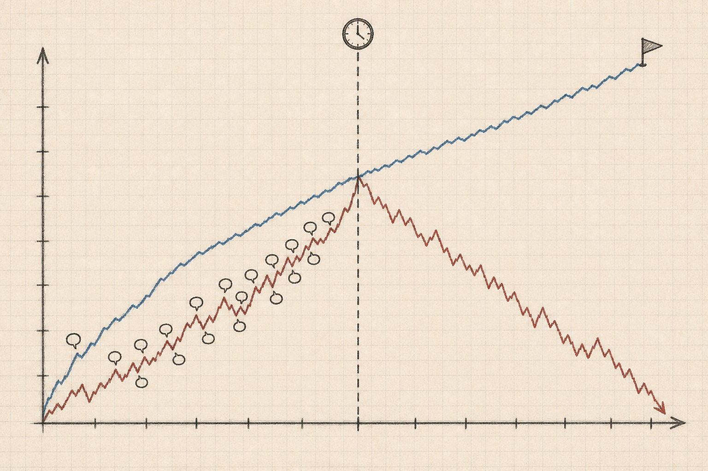

# autoquant-research


<p align="center">
  <a href="https://github.com/Heihaierr/autoquant-research/actions/workflows/ci.yml"></a>
  <a href="LICENSE"></a>
  <a href="skills/"></a>
  <a href="https://github.com/Heihaierr/autoquant-research/stargazers"></a>
</p>

<p align="center">
  <a href="docs/en/README.md">English</a> | <b>简体中文</b>
</p>

**一套自动化的量化策略研究方法论，装进 AI agent 就能自己跑起来——帮你把真正靠谱的策略找出来，把那些看着不错、其实一戳就破的提前筛掉。**

这是一套系统化的策略研究方法，覆盖 ETF、基金、个股的多资产配置，用分阶段
滚动测试（walk-forward，把历史数据切成一段一段，每一段都用没见过的数据
去验证）来验证效果，老老实实做业绩归因分析——赚了亏了，说清楚到底是因为
什么。它打包成一组"Agent Skills"，可以直接装进 AI 编程助手，不是一个要写
代码调用的框架，不需要安装任何依赖。装进 Claude Code、Cursor、Codex，或者
任何支持 Agent Skills 的 AI agent，它就能带着你把整套研究流程从头跑到尾：
先跟你聊一次目标，然后自己去拉数据、搭建并测试回测引擎、找出策略背后到底
是什么原理在起作用、做诚实的评测、给出最终结论、上线后持续跟踪对账——中途
不会再打断你，除非真的遇到了只有你自己才能拍板的关键分岔。

## 快速开始

<details open>
<summary><b>Claude Code</b></summary>

```bash
/plugin marketplace add Heihaierr/autoquant-research
/plugin install autoquant-research@autoquant-research
```
</details>

<details>
<summary><b>Cursor</b></summary>

```text
/add-plugin autoquant-research
```

或者直接克隆到 skills 目录：
```bash
git clone https://github.com/Heihaierr/autoquant-research ~/.cursor/skills/autoquant-research
```
</details>

<details>
<summary><b>任何支持 portable Agent Skills 的 agent</b></summary>

```bash
git clone https://github.com/Heihaierr/autoquant-research
```
把你的 agent 的 skill 目录指向 `skills/` 即可。这些 skill 都是纯 Markdown +
YAML frontmatter，没有任何运行时依赖。
</details>

装好之后，直接跟你的 agent 聊一个策略想法就行。`using-autoquant` 是所有其他
skill 的入口，它会先问你唯一一件它自己拿不了主意的事——目标——然后把剩下的
流程自己跑完。

想先看看效果，不急着接自己的数据？`templates/` 里带了两张现成的价格表，
断网、不需要任何 API key 就能跑完整流程：

```bash
cd templates && pip install -r requirements.txt
pytest tests/ -q
PYTHONPATH=. python framework/walk_forward.py --config config.us.yaml --strategy s0_passive
```

## 为什么要做这个

市面上已经有工具能扫描你的回测代码，找出未来函数、漏算成本，它们有用——但
**静态检查只能抓代码层面的错误，抓不到推理层面的错误。** 比如"真实可执行的
选股/选基规则跑不过基准，但那是因为基准本身是用后来才知道的走势倒推出来的，
不公平，这个差距不算数"——这类结论可以完全建立在算得没错的数字上，结论却
仍然是错的，因为把一个测出来的差距归到正确的原因上，是一次主观判断，不是
一个统计量，算术本身完全不会检查这次判断有没有走对。这就是这套方法要补上
的那一小块：把标准的验证方法按正确的顺序串起来，并且在一项检验刚好通过、
快要被写成结论之前，把那些容易踩的推理陷阱提前点出来。

## 研究闭环

`using-autoquant` 是入口。下面几个阶段它一个都不亲自动手——它只负责把活派
下去、检查每一次交接有没有问题，让这个循环转下去，中途不会打断你。

| | Skill | 负责什么 |
|---|---|---|
| | [`using-autoquant`](skills/using-autoquant/SKILL.md) | 入口：把下面几个阶段派发下去，手里握着一份"什么情况下才允许打断你"的清单，清单之外的事自己拿主意 |
| ① | [`framing-the-goal`](skills/framing-the-goal/SKILL.md) | 把目标定清楚：想要什么、账户能买什么、下单规则是什么、成本怎么算。唯一需要你亲自参与的一步 |
| ② | [`building-the-foundation`](skills/building-the-foundation/SKILL.md) | 抓数据、查数据质量，测试回测引擎有没有 bug，再搭一个"什么都不做"的基准组合——后面每个数字都要拿它当参照 |
| ③ | [`running-experiments`](skills/running-experiments/SKILL.md) | 候选策略从哪来：先梳理可能有效的原理、按影响大小排序、提前写好判断标准，不能等看到结果才定；然后判断一个结果是不是真管用：同一个策略用粗中细三种颗粒度分别测、故意错开几天调仓再测一遍、成本往高往低都测一遍 |
| ④ | [`judging-the-round`](skills/judging-the-round/SKILL.md) | 把好坏的差距归到具体是哪个环节造成的，然后三选一——上线、继续迭代、还是直接放弃——不管选哪个都要把这一轮记录下来 |
| ⑤ | [`shipping-and-tracking`](skills/shipping-and-tracking/SKILL.md) | 整理一套完整证据，把参数彻底冻住不再改，上线之后从数据、执行、策略三个层面分别对账 |

还有一个不是阶段，因此在上面这条链里没有位置：

| | Skill | 负责什么 |
|---|---|---|
| ★ | [`detecting-self-deception`](skills/detecting-self-deception/SKILL.md) | 靠几个写死的具体条件触发——比如夏普比率超过 1.5、超额收益超过 2 个百分点、一份结论快要写下——而不是等你自己觉得"这结果看起来不错"才想起来查一遍 |

它是个循环，因为真实研究要绕好几圈，而每次从 `judging-the-round` 绕回
`running-experiments`，带回去的都应该是一个没试过的新方向，不是刚失败那个
方向的又一次重复。

每个 skill 也可以单独调用——"帮我评测一下这个已有的策略"直接进
`running-experiments`，"我现在有资金，今天该买什么"直接进
`shipping-and-tracking`——不需要从头走完整个流程。

<p align="center">
  
</p>

## 和其他工具比

| | 一个普通的 coding agent | 回测框架（backtrader、vectorbt……） | 未来函数/数据泄漏检查工具 | **autoquant-research** |
|---|---|---|---|---|
| 是什么 | 一个空白的 prompt | 一个你拿来写策略的引擎 | 一个静态检查器 | 一套打包成 Agent Skills 的完整研究流程 |
| 抓代码层面的错误（未来函数、时间戳泄漏） | 你问了才查 | 不抓 | 抓 | 抓，靠回测引擎的正确性测试 |
| 抓推理层面的错误（数字算对了，结论却是错的） | 不抓 | 不抓 | 不抓 | 抓——这就是它存在的意义 |
| 下结论前强制要求分阶段滚动测试 + 成本压力测试 | 不强制 | 不强制 | 不强制 | 强制 |
| 带一份能跑的参考实现 | 没有 | 有，生产级 | 没有 | 有，教学级——不建议直接拿去实盘用 |
| 需要 import 或依赖 | —— | 需要 | 有的需要 | 不需要——纯 Markdown，没有运行时 |

它是和另外三种工具配合用的：回测引擎用回测框架跑，代码过一遍检查工具，剩下
那一层——一个算对的数字得出的结论到底是不是真的——用这个。

## 用模板

`templates/` 是这套方法的**参考实现**，不是一个要依赖的库。它让上面的 skill
可核验而不是空谈——你能看到未来函数防护具体长什么样，研究截止日期是哪一行
代码断言的，三层对账到底怎么算的。

随包带了两张价格表——11 只美股 ETF（自 2006 年）、11 只 A 股 ETF（自 2011 年），
均为总回报复权，且都用第二数据源交叉验证过——所以断网、不需要任何 API key 就能跑：

```bash
cd templates && pip install -r requirements.txt

pytest tests/ -q                                                     # 引擎 + 对账逻辑的断言
PYTHONPATH=. python data/qc_data_quality.py --config config.us.yaml   # 数据是真的吗？
PYTHONPATH=. python framework/walk_forward.py --config config.us.yaml --strategy s0_passive
```

换成 `config.cn.yaml` 就是 A 股那张表。完整说明见
[`templates/README.md`](templates/README.md)。

要接自己的市场：把整个目录复制一份，换掉市场相关的部分（标的代码、涨跌幅规则、
成本模型）——或者直接读源码，把同样的防护搬进你已有的技术栈。

```bash
cp -r templates/ my-research-project/
```

## 适用边界（诚实说明）

这套方法论本身不绑定载体——`framing-the-goal` 会先问清楚你的账户到底能买
什么（ETF、场外基金、个股），后面整个流程都按这个答案走。`templates/` 里
带的参考实现演示的是全球多资产 ETF 轮动——美股与中国境内场内外载体，日线
数据，月频调仓，只做多，不加杠杆——这只是因为它是最简单、能讲完整的例子，
不是这套方法能处理的上限。

个股比 ETF 篮子多几个 ETF 没有的问题——单一标的退市和公司行动、财报驱动的
跳空、板块和因子拥挤、你真正想交易的那些标的流动性更差——参考实现没有为
任何一条配防护。如果你要把这套方法用在个股上，把 `building-the-foundation`
里的数据质检那一层当成一个需要往上补的地板，而不是一个已经封顶的天花板。

**能迁移的是判断逻辑**：把差距归到正确的环节、把普遍有效和纯属运气分开、把
调仓日踩中的运气和研究窗口踩中的运气分开、搞清楚一次验证到底还留下了什么
没测到。这些是人和 agent 怎么被回测忽悠的问题，跟具体是哪个市场没关系。

**不会自动迁移的**：针对某一个市场校准的具体阈值——涨跌幅表、成本模型、
换一天调仓测出来的结果分散到什么程度就该判定为不稳定。每个 skill 里都明确
写了哪些数字只是示例、需要你按自己的情况重新校准，哪些是不管市场都成立的
结构性规则。

**完全没覆盖的**：机构规模下的资金容量和市场冲击成本、经典意义上的（退市
标的意义上的）幸存者偏差、正式的多重检验校正方法（比如 deflated Sharpe
ratio）、把汇率波动当作独立风险因子来处理，以及任何日内交易、加杠杆或者
衍生品相关的场景。如果你的研究正好落在这些范围里，把这套方法当作起点，
而不是一份完整答案。

## 理念

- **研究的目的不是找到一个好看的回测。** 是搞清楚一个好看的回测到底说明了什么。
- **每一种验证方法回答的问题，都比你实际在问的更窄。** 把它没回答的部分写下来。
- **报告边界比制造数字更有价值。** 研究和造假的区别，就在于你是说"我们找过了，
  它不在那"，还是悄悄放低标准直到输出看起来还行。
- **一个原理能排除一整类尝试，一个数字只能排除一次尝试。** 不管走哪个出口，
  都要把这一轮记下来。

## 参与贡献

见 [CONTRIBUTING.md](CONTRIBUTING.md)。最有价值的贡献是让某个 skill 的
流程更精确、修正一个在别的市场上是错的阈值，或者补上流程里的一个缺口——
不是策略代码或实盘参数。

## 免责声明

本仓库是研究方法论，不是投资建议。见 [DISCLAIMER.md](DISCLAIMER.md)。
