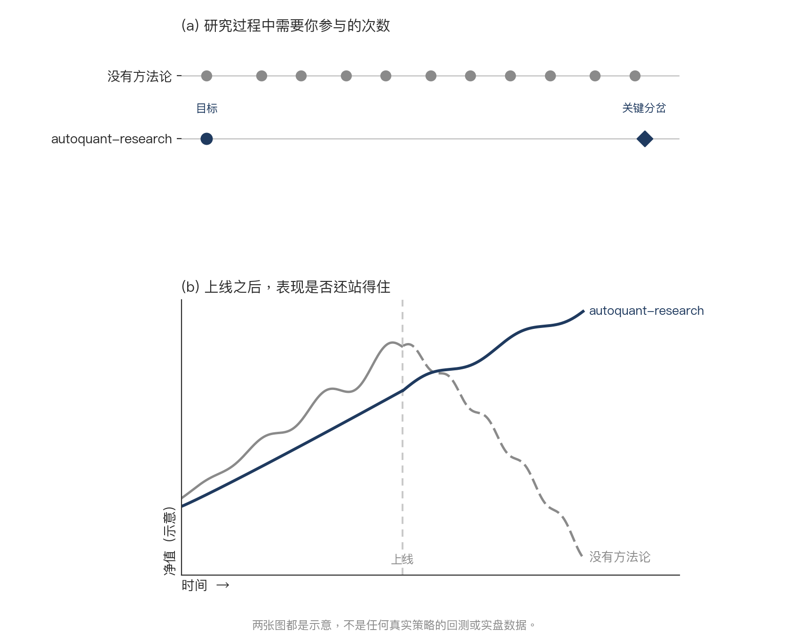
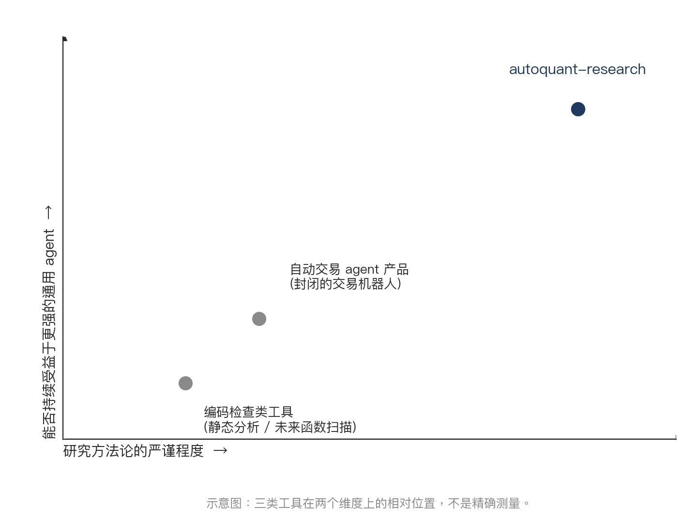

# autoquant-research


<p align="center">
  <a href="https://github.com/Heihaierr/autoquant-research/actions/workflows/ci.yml"></a>
  <a href="LICENSE"></a>
  <a href="skills/"></a>
  <a href="https://github.com/Heihaierr/autoquant-research/stargazers"></a>
</p>

<p align="center">
  <a href="docs/en/README.md">English</a> | <b>简体中文</b>
</p>

**量化策略研究界的 superpowers——一套装进 AI agent / 智能体就能自动跑起来
的量化研究方法论，帮你把真正靠谱的策略找出来，把那些看着不错、其实一戳
就破的提前筛掉。**

覆盖 ETF 轮动、股票选股、多资产配置的量化投资研究：用 walk-forward 滚动
回测验证效果，严格做数据质量检查和业绩归因分析，把"回测好看"和"真的能
赚钱"的策略分开。打包成一组 Agent Skills，装进 Claude Code、Cursor、
Codex 等任意 AI agent 就能直接用——不是要写代码调用的框架，不需要安装
任何依赖。

## 核心特点

- **实验更科学**：先找出真正起作用的机制，再逐步验证，目标是一个放到未来
  也大概率有效的策略，不是历史数据里凑出来的好看曲线。
- **验证更严格**：数据先过质量检查，策略要在不同时间窗口、不同成本假设下
  反复测试，结果站得住脚才算数。
- **目标更懂你**：结合你的风险偏好、交易习惯和账户限制来定研究目标，不是
  什么人都套同一个模板。
- **踩坑更少**：方法沉淀自大量真实研究，常见的坑已经写进流程里，用更少的
  对话、更少的 token 就能跑到一个靠谱的结论。

## 快速开始

<details open>
<summary><b>Claude Code</b></summary>

```bash
/plugin marketplace add Heihaierr/autoquant-research
/plugin install autoquant-research@autoquant-research
```
</details>

<details>
<summary><b>Cursor</b></summary>

```text
/add-plugin autoquant-research
```

或者直接克隆到 skills 目录：
```bash
git clone https://github.com/Heihaierr/autoquant-research ~/.cursor/skills/autoquant-research
```
</details>

<details>
<summary><b>任何支持 portable Agent Skills 的 agent</b></summary>

```bash
git clone https://github.com/Heihaierr/autoquant-research
```
把你的 agent 的 skill 目录指向 `skills/` 即可。这些 skill 都是纯 Markdown +
YAML frontmatter，没有任何运行时依赖。
</details>

装好之后，直接跟你的 agent 聊一个策略想法就行。`using-autoquant` 是所有其他
skill 的入口，它会先问你唯一一件它自己拿不了主意的事——目标——然后把剩下的
流程自己跑完。

想先看看效果，不急着接自己的数据？`templates/` 里带了两张现成的价格表，
断网、不需要任何 API key 就能跑完整流程：

```bash
cd templates && pip install -r requirements.txt
pytest tests/ -q
PYTHONPATH=. python framework/walk_forward.py --config config.us.yaml --strategy s0_passive
```

## 研究闭环

`using-autoquant` 是入口。下面几个阶段它一个都不亲自动手——它只负责把活派
下去、检查每一次交接有没有问题，让这个循环转下去，中途不会打断你。

| | Skill | 负责什么 |
|---|---|---|
| | [`using-autoquant`](skills/using-autoquant/SKILL.md) | 入口：把下面几个阶段派发下去，手里握着一份"什么情况下才允许打断你"的清单，清单之外的事自己拿主意 |
| ① | [`framing-the-goal`](skills/framing-the-goal/SKILL.md) | 把目标定清楚：想要什么、账户能买什么、下单规则是什么、成本怎么算。唯一需要你亲自参与的一步 |
| ② | [`building-the-foundation`](skills/building-the-foundation/SKILL.md) | 抓数据、查数据质量，测试回测引擎有没有 bug，再搭一个"什么都不做"的基准组合——后面每个数字都要拿它当参照 |
| ③ | [`running-experiments`](skills/running-experiments/SKILL.md) | 候选策略从哪来：先梳理可能有效的原理、按影响大小排序、提前写好判断标准，不能等看到结果才定；然后判断一个结果是不是真管用：同一个策略用粗中细三种颗粒度分别测、故意错开几天调仓再测一遍、成本往高往低都测一遍 |
| ④ | [`judging-the-round`](skills/judging-the-round/SKILL.md) | 把好坏的差距归到具体是哪个环节造成的，然后三选一——上线、继续迭代、还是直接放弃——不管选哪个都要把这一轮记录下来 |
| ⑤ | [`shipping-and-tracking`](skills/shipping-and-tracking/SKILL.md) | 整理一套完整证据，把参数彻底冻住不再改，上线之后从数据、执行、策略三个层面分别对账 |

还有一个不是阶段，因此在上面这条链里没有位置：

| | Skill | 负责什么 |
|---|---|---|
| ★ | [`detecting-self-deception`](skills/detecting-self-deception/SKILL.md) | 靠几个写死的具体条件触发——比如夏普比率超过 1.5、超额收益超过 2 个百分点、一份结论快要写下——而不是等你自己觉得"这结果看起来不错"才想起来查一遍 |

它是个循环，因为真实研究要绕好几圈，而每次从 `judging-the-round` 绕回
`running-experiments`，带回去的都应该是一个没试过的新方向，不是刚失败那个
方向的又一次重复。

每个 skill 也可以单独调用——"帮我评测一下这个已有的策略"直接进
`running-experiments`，"我现在有资金，今天该买什么"直接进
`shipping-and-tracking`——不需要从头走完整个流程。

<p align="center">
  
</p>

## 和其他工具比

<p align="center">
  
</p>

**跟回测代码检查工具比，赢在方法论。** 它们能抓未来函数、抓漏算成本，这些
都对，但都是代码层面的错误——数字算对了、结论却推错了，它们看不出来。
autoquant-research 把 walk-forward、多 offset 压力测试、双重成本档位这些
标准验证方法按正确的顺序串起来，专门补这一块。

**跟自动交易 agent 产品比，赢在灵活性。** 那类产品通常是一套封闭的自动化
管线，底层 agent 能力再怎么进步，它自己不会跟着变强。autoquant-research 是
装进通用 AI agent（Claude Code、Cursor、Codex……）里跑的一组 Agent Skills，
底层 agent 每一次变强，它都直接受益，不用等产品方重新开发。

## 用模板

`templates/` 是这套方法的**参考实现**，不是一个要依赖的库。它让上面的 skill
可核验而不是空谈——你能看到未来函数防护具体长什么样，研究截止日期是哪一行
代码断言的，三层对账到底怎么算的。

随包带了两张价格表——11 只美股 ETF（自 2006 年）、11 只 A 股 ETF（自 2011 年），
均为总回报复权，且都用第二数据源交叉验证过——所以断网、不需要任何 API key 就能跑：

```bash
cd templates && pip install -r requirements.txt

pytest tests/ -q                                                     # 引擎 + 对账逻辑的断言
PYTHONPATH=. python data/qc_data_quality.py --config config.us.yaml   # 数据是真的吗？
PYTHONPATH=. python framework/walk_forward.py --config config.us.yaml --strategy s0_passive
```

换成 `config.cn.yaml` 就是 A 股那张表。完整说明见
[`templates/README.md`](templates/README.md)。

要接自己的市场：把整个目录复制一份，换掉市场相关的部分（标的代码、涨跌幅规则、
成本模型）——或者直接读源码，把同样的防护搬进你已有的技术栈。

```bash
cp -r templates/ my-research-project/
```

## 免责声明

本仓库是研究方法论，不是投资建议。见 [DISCLAIMER.md](DISCLAIMER.md)。
