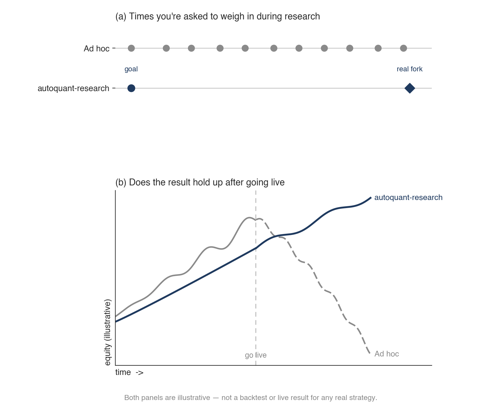

# autoquant-research


<p align="center">
  <a href="https://github.com/Heihaierr/autoquant-research/actions/workflows/ci.yml"></a>
  <a href="../../LICENSE"></a>
  <a href="../../skills/"></a>
  <a href="https://github.com/Heihaierr/autoquant-research/stargazers"></a>
</p>

<p align="center">
  <a href="../../README.md">简体中文</a> | <b>English</b>
</p>

**The superpowers of quant strategy research — an automated research
methodology that runs inside your AI agent, surfacing the strategies that
actually hold up and screening out the ones that only look good.**

A systematic trading research methodology for ETF rotation, stock
picking, and multi-asset allocation: walk-forward backtesting, strict
data quality checks, and honest performance attribution that separate
strategies that look profitable from ones that actually are. Ships as a
set of Agent Skills for Claude Code, Cursor, Codex, or any AI agent — not
a framework to import, nothing to install.

## Core features

- **Sharper experiments.** Finds the mechanism first, then validates it
  step by step — aimed at a strategy with a real chance of working
  forward, not a curve that only looks good in hindsight.
- **Stricter validation.** Every price series passes a quality check, and
  every strategy is tested across time windows and cost assumptions
  before it's trusted.
- **A goal that fits you.** Shaped by your risk tolerance, trading habits,
  and what your account can actually buy — not a generic default.
- **Fewer wasted steps.** Built from real research, so common failure
  modes are already in the process — fewer conversations, fewer tokens,
  to a conclusion worth trusting.

## Quick start

<details open>
<summary><b>Claude Code</b></summary>

```bash
/plugin marketplace add Heihaierr/autoquant-research
/plugin install autoquant-research@autoquant-research
```
</details>

<details>
<summary><b>Cursor</b></summary>

```text
/add-plugin autoquant-research
```

Or clone into your skills directory:
```bash
git clone https://github.com/Heihaierr/autoquant-research ~/.cursor/skills/autoquant-research
```
</details>

<details>
<summary><b>Any agent that reads portable Agent Skills</b></summary>

```bash
git clone https://github.com/Heihaierr/autoquant-research
```
Point your agent's skill directory at `skills/`. The skills are plain Markdown
with YAML frontmatter and no runtime dependencies.
</details>

Then just talk to your agent about a strategy idea. `using-autoquant` is the
entry point every other skill is reached from, and it will ask you the one
thing it cannot decide for you — the target — before running the rest of the
loop on its own.

Want to see it work before pointing it at your own data? Two demo price tables
ship in `templates/`, so the full loop runs with no network access and no API
key:

```bash
cd templates && pip install -r requirements.txt
pytest tests/ -q
PYTHONPATH=. python framework/walk_forward.py --config config.us.yaml --strategy s0_passive
```

## The research loop

`using-autoquant` is the entry point. It executes none of the stages below —
it dispatches them, checks each handoff, and keeps the loop turning without
asking you at every step.

| | Skill | What it owns |
|---|---|---|
| | [`using-autoquant`](../../skills/using-autoquant/SKILL.md) | The entry point: dispatches the stages below, and holds the closed list of conditions that justify interrupting you |
| ① | [`framing-the-goal`](../../skills/framing-the-goal/SKILL.md) | The target, the vehicle, the execution semantics and the cost model. The only stage that is a conversation |
| ② | [`building-the-foundation`](../../skills/building-the-foundation/SKILL.md) | Data acquisition and QC, engine correctness tests, and the passive control every later number is read against |
| ③ | [`running-experiments`](../../skills/running-experiments/SKILL.md) | Where candidates come from — the mechanism map, sensitivity ranking, pre-registered decision line — and whether a result means anything: three report layers, staggered offsets, both cost tiers |
| ④ | [`judging-the-round`](../../skills/judging-the-round/SKILL.md) | Attribute the gap to a layer, take one of three exits — SHIP, ITERATE, STOP — and file the round either way |
| ⑤ | [`shipping-and-tracking`](../../skills/shipping-and-tracking/SKILL.md) | The evidence package, the parameter freeze, and three-layer reconciliation once the strategy is live |

One skill is not a stage and has no place in that sequence:

| | Skill | What it owns |
|---|---|---|
| ★ | [`detecting-self-deception`](../../skills/detecting-self-deception/SKILL.md) | Fires on mechanical conditions — a Sharpe above 1.5, an excess above 2pp, a verdict about to be written — rather than on your judgement that a result looks good |

It's a loop because real research goes around more than once, and each pass
back into `running-experiments` carries a named, untried mechanism category
rather than a repeat of the one that just failed.

Each skill can also be called on its own — "evaluate this strategy I already
have" goes straight to `running-experiments`, "I have capital, what do I buy
today" goes to `shipping-and-tracking` — without walking the full loop from
the top.

<p align="center">
  
</p>

## How this compares

<p align="center">
  
</p>

**Against AI coding tools, the win is methodology.** They catch
look-ahead bugs and uncosted turnover, correctly — but those are code-level
errors. A right number leading to a wrong conclusion is invisible to them.
autoquant-research chains the standard validation techniques — walk-forward,
multi-offset stress, both cost tiers — in the order that actually catches
that gap.

**Against trading agent products, the win is flexibility.** Those are
usually closed automation pipelines that don't get smarter just because the
underlying model does. autoquant-research is a set of Agent Skills that runs
inside a general-purpose AI agent (Claude Code, Cursor, Codex, …), so every
improvement to the agent underneath it is an improvement to this, with
nothing to upgrade on our end.

## Using the templates

`templates/` is the **reference implementation of the spec**, not a library
to depend on. It exists so the skills above are verifiable rather than
aspirational: you can see exactly what a look-ahead guard looks like, which
line asserts the research cutoff, and how three-layer reconciliation is
actually computed.

Two price tables ship with it — 11 US ETFs from 2006, 11 A-share ETFs from
2011, both total-return adjusted and cross-checked against a second source —
so this runs with no network access and no API key:

```bash
cd templates && pip install -r requirements.txt

pytest tests/ -q                                                     # engine + reconciliation assertions
PYTHONPATH=. python data/qc_data_quality.py --config config.us.yaml   # is the data real?
PYTHONPATH=. python framework/walk_forward.py --config config.us.yaml --strategy s0_passive
```

Swap in `config.cn.yaml` for the A-share table. Full walkthrough, including
what each script checks and why: [`templates/README.md`](../../templates/README.md).

For your own market: copy the directory and replace the market-specific parts
(instrument codes, price limits, cost model) with your own — or read it and
implement the same guards in whatever stack you already have.

```bash
cp -r templates/ my-research-project/
```

## License

MIT
